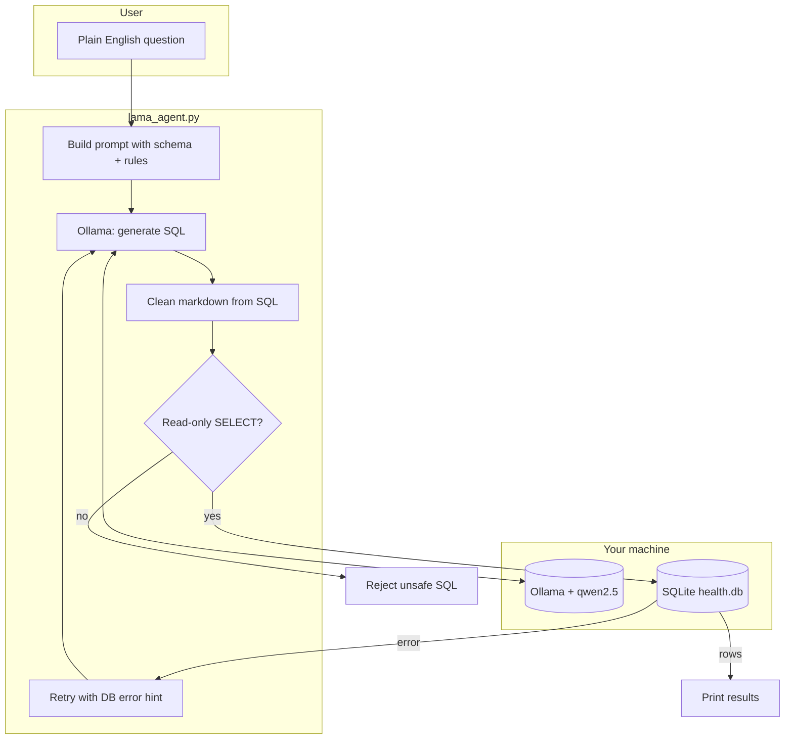

# SQL Agent — Ask Your Health Data in Plain English

A small **text-to-SQL** project: you type a question like *“What is my highest HRV?”* and a **local AI** (Ollama) turns it into SQL, runs it on your SQLite database, and prints the answer.

Everything runs on your Mac — no cloud API keys required for the LLM step.

---

## What this project does (in simple terms)

1. **Build a fake health dataset** — heart rate, sleep, steps, mood, caffeine, and more (300 sample rows).
2. **Store it in SQLite** — one table called `health_logs`, easy to query.
3. **Chat with your data** — the agent sends your question + table schema to Ollama, gets back SQL, cleans it, checks it is read-only, runs it, and shows rows.
4. **Explore patterns manually** — `analysis.py` runs fixed SQL to compare sleep, mood, caffeine, and stress.

This is a learning prototype for **natural language → SQL → database**, not a medical product.

---

## System design

High-level flow: **you ask → LLM writes SQL → safety check → SQLite → results**.



### Components

| Piece | File | Role |
|--------|------|------|
| **Database layer** | `db.py` | Opens `health.db` — single place for DB path |
| **Seed data** | `setup_health_db.py` | Creates `health_logs` and inserts 300 random rows |
| **SQL agent** | `lama_agent.py` | Ollama chat → SQL → validate → execute → optional retry |
| **Exploratory SQL** | `analysis.py` | Hand-written queries (sleep vs mood, caffeine vs stress) |
| **Smoke test** | `test_query.py` | Prints first 5 rows to confirm DB works |

### Data model

One table tracks wearable, behavior, and nutrition fields per timestamp:

```
health_logs
├── id, user_id, timestamp
├── heart_rate, hrv, sleep_hours, steps, calories_burned   (wearable)
├── mood, energy, stress                                   (behavior)
└── calories_intake, caffeine_mg, meal_type                (nutrition)
```

### Safety choices (prototype level)

- Only **SELECT** queries are allowed (blocks `DELETE`, `DROP`, etc.).
- Schema is sent in the prompt so the model stays on known columns.
- If SQL fails, the agent **retries once** and passes the error message back to the model.

---

## Project structure

```
SQL_agent/
├── db.py                 # SQLite connection helper
├── setup_health_db.py    # Create DB + sample data
├── lama_agent.py         # Main NL → SQL agent (Ollama)
├── analysis.py           # Example analytics queries
├── test_query.py         # Quick DB sanity check
├── health.db             # SQLite database (generated locally)
├── requirements.txt      # Python: ollama
└── README.md
```

---

## Prerequisites

- **Python 3.10+**
- **[Ollama](https://ollama.com)** installed and running
- Model pulled (this repo uses **qwen2.5**):

  ```bash
  ollama pull qwen2.5
  ```

---

## Setup

```bash
git clone <your-repo-url>
cd SQL_agent

python3 -m venv .venv
source .venv/bin/activate
pip install -r requirements.txt

python setup_health_db.py
```

---

## Run the agent

```bash
source .venv/bin/activate
python lama_agent.py
```

Or without activating the venv:

```bash
.venv/bin/python lama_agent.py
```

### Example questions

| You type | What happens |
|----------|----------------|
| `What is my average heart rate?` | `AVG(heart_rate)` |
| `What is my highest HRV?` | `MAX(hrv)` |
| `How many rows are in health_logs?` | `COUNT(*)` |

The agent prints the generated SQL and the result rows.

### Other scripts

```bash
python test_query.py      # first 5 rows
python analysis.py        # sleep/mood/caffeine/stress summaries
```

---

## How the agent works (step by step)

1. You enter a question in the terminal loop.
2. `generate_sql()` sends the question + `health_logs` schema + rules to **Ollama**.
3. `clean_sql()` removes markdown code fences (models often wrap SQL in ` ```sql `).
4. `is_read_only_sql()` ensures the query is a safe **SELECT**.
5. `run_sql()` executes against `health.db` via `db.get_connection()`.
6. On error, one **retry** asks the model to fix SQL using the SQLite error text.

---

## What is done so far

- [x] SQLite schema and 300-row synthetic health dataset
- [x] Shared DB module (`db.py`)
- [x] Local LLM integration with Ollama (`qwen2.5`)
- [x] Text-to-SQL prompt with schema grounding
- [x] SQL cleaning, read-only guard, and error retry
- [x] Interactive CLI for questions
- [x] Basic exploratory analysis script
- [x] Python virtual environment + `requirements.txt`

---

## Possible next steps

- Natural-language **summary** of query results (second LLM call)
- More test questions in `test_query.py` for regression checks
- Return **timestamp** with max/min metrics (e.g. when highest HRV occurred)
- Optional web UI (Streamlit / FastAPI) instead of terminal only
- Real wearable import (CSV / Apple Health) instead of random seed data

---

## Troubleshooting

| Problem | Fix |
|---------|-----|
| `No module named 'ollama'` | Activate `.venv` and `pip install -r requirements.txt` |
| `command not found: python` | Use `python3` or activate the venv (then `python` works) |
| Model not found | `ollama pull qwen2.5` or change `MODEL` in `lama_agent.py` to match `ollama list` |
| Cannot connect to Ollama | Start the Ollama app or run `ollama serve` |

---

## License

Add a license file if you plan to publish the repo (e.g. MIT).

---

## Author note

Built as a hands-on intro to **SQL agents**: small data layer, local LLM, strict read-only queries, and a clear path to improve prompts and evaluation over time.
