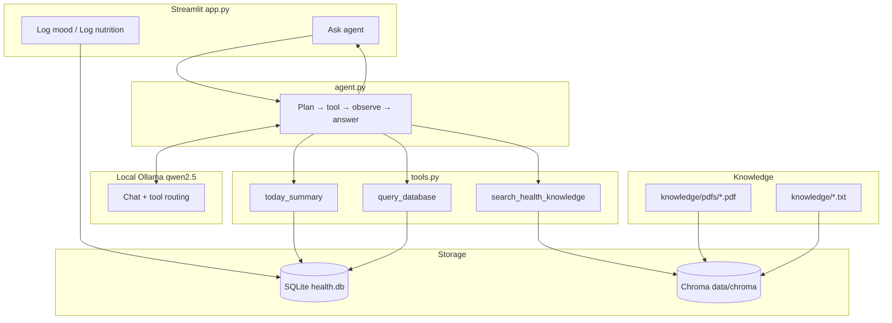

# Health Diary + SQL Agent

A **local-first health tracking app** with a minimalist Streamlit UI, a SQLite diary for mood and nutrition, demo wearable metrics, and an **Ollama-powered agent** that answers questions about *your data* (SQL) and *general health knowledge* (RAG from PDFs).

## 🚀 Demo

👉 [Click here for demo](https://healthdiary.streamlit.app/)

No cloud API keys required. Everything runs on your machine: **Ollama**, **SQLite**, and **Chroma** for vector search.

> Learning project — not medical advice. General nutrition text from RAG does not replace a doctor or dietitian.

---

## What it does

| Feature | Description |
|---------|-------------|
| **Log mood** | Sliders for mood, energy, stress; optional note → `mood_logs` |
| **Log nutrition** | Meals, calories, caffeine, description → `food_logs` |
| **Demo wearable** | Daily steps, sleep, heart rate in `wearable_daily` (seeded from sample data until Apple Health import) |
| **Ask agent** | Natural-language questions on Overview: combines SQL on your logs + RAG on health PDFs |
| **Short memory** | Follow-up questions in the same Streamlit session |
| **CLI agent** | `python lama_agent.py` for simple SQL-only Q&A in the terminal |

---

## System design



### Two kinds of answers

1. **Personal data** — Agent runs read-only `SELECT` on `mood_logs`, `food_logs`, `wearable_daily` (e.g. *What did I eat today?*).
2. **General knowledge (RAG)** — Agent searches embedded chunks from your PDFs/text (e.g. *How does caffeine affect cortisol?*).

The model can use **both** in one conversation (e.g. your caffeine logs + hormone education snippets).

---

## Data model

Defined once in **`schema.py`** (DDL + agent prompt text stay in sync).

| Table | Source | Contents |
|-------|--------|----------|
| `mood_logs` | Streamlit | `logged_at`, mood, energy, stress, note |
| `food_logs` | Streamlit | `logged_at`, meal_type, calories, caffeine_mg, description |
| `wearable_daily` | Demo seed / future import | One row per day: steps, sleep_hours, hr_avg, hrv_avg, calories_burned |

Legacy table `health_logs` may still exist in old databases; the agent uses the three tables above.

---

## Project structure

```
SQL_agent/
├── app.py                  # Streamlit UI (Overview, mood, nutrition, ask agent)
├── agent.py                # Multi-step agent loop (tools + memory)
├── tools.py                # Tool implementations (SQL, summary, RAG)
├── lama_agent.py           # Simple SQL-only agent (terminal)
├── schema.py               # Single source of truth for tables + prompts
├── db.py                   # SQLite connection
├── rag.py                  # Chroma ingest + search
├── ingest_knowledge.py     # Index PDFs/text into vector DB
├── demo_agent.py           # Fallback agent without Ollama (cloud deploy)
├── deploy_utils.py         # Cloud demo helpers
├── knowledge/
│   ├── pdfs/               # Drop your health PDFs here
│   ├── *.txt               # Optional plain-text sources
│   └── sample_hormones_nutrition.txt
├── data/chroma/            # Vector store (gitignored)
├── assets/                 # UI images
├── DEPLOY.md               # Streamlit Cloud instructions
└── requirements.txt
```

---

## Prerequisites

- **Python 3.10+**
- **[Ollama](https://ollama.com)** running locally (full AI; optional for cloud demo)
- Model:

  ```bash
  ollama pull qwen2.5
  ```

---

## Setup

```bash
git clone https://github.com/AlbinaKrasykova/SQL_agent.git
cd SQL_agent

python3 -m venv .venv
source .venv/bin/activate
pip install -r requirements.txt

python schema.py
python ingest_knowledge.py
```

---

## Share a public link

Deploy free on **Streamlit Community Cloud** so anyone can open your app in a browser.

See **[DEPLOY.md](DEPLOY.md)** for step-by-step: push to GitHub → [share.streamlit.io](https://share.streamlit.io) → main file `app.py`.

Public hosting uses **demo agent** (no Ollama). Full AI runs on your Mac with Ollama installed.

---

## Run

### Streamlit (main app)

```bash
source .venv/bin/activate
streamlit run app.py
```

Open **http://localhost:8501**

### Terminal (SQL-only)

```bash
python lama_agent.py
```

### Re-index PDFs

```bash
python ingest_knowledge.py
python ingest_knowledge.py --reset   # full rebuild
```

---

## Example questions

| Question | Typical tools |
|----------|----------------|
| What did I eat today? | `query_database` |
| What is my average mood? | `query_database` |
| How does caffeine affect cortisol? | `search_health_knowledge` |

---

## Troubleshooting

| Problem | Fix |
|---------|-----|
| `No module named 'ollama'` | `source .venv/bin/activate` && `pip install -r requirements.txt` |
| Model not found | `ollama pull qwen2.5` |
| Agent returns no RAG results | Run `python ingest_knowledge.py` |
| Streamlit won't start | `.venv/bin/streamlit run app.py` |

---

## License

Add a license (e.g. MIT) when you publish the repository.

---

Built as a hands-on stack: **diary UI → structured SQLite → tool-using agent → RAG** — all local and extensible.
